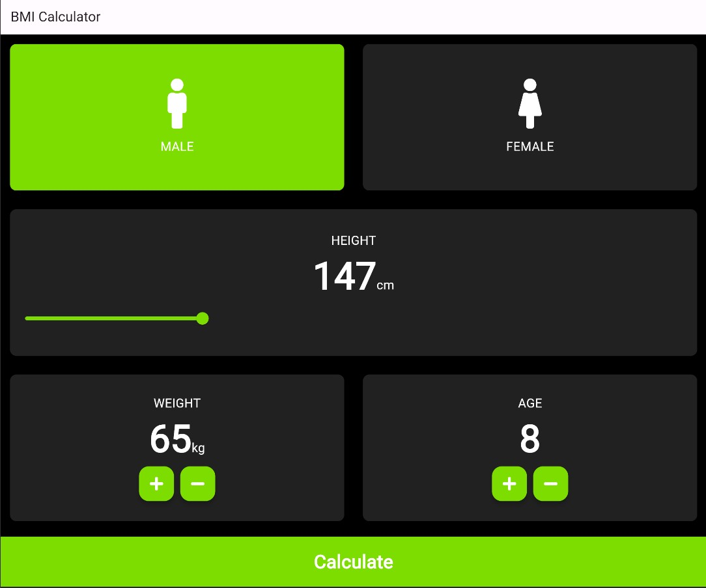

# BMI Calculator App

This is a flutter based simple BMI Calculator app which calculated Body Mass Index..

One of the first simple apps I created while on my journey to learn Flutter.

### Dependencies

1. [Font Awesome Flutter](https://pub.dev/packages/font_awesome_flutter)

2. [Flutter Launcher Icons](https://pub.dev/packages/flutter_launcher_icons)

## Setup

##### Clone the repository

```bash
git https://github.com/9ani/BMI_calculator_on_Flutter
```

##### Move to the desired folder

```bash
cd \BMI-Calculator-App
```

##### To run the app, simply write

```bash
flutter run -d chrome
```
